### 一. 链接的本质与执行时机
链接是将各种代码和数据片段收集并组合为单一可执行文件的过程，该文件可加载到内存中执行。链接过程的核心价值体现在：
- **分离编译**：允许模块化开发
- **符号解析**：解决跨模块的符号引用
- **空间优化**：实现代码共享和复用

| 链接类型     | 执行阶段         | 特点                          | 应用场景              |
|--------------|------------------|-----------------------------|---------------------|
| 编译时链接   | 源代码翻译阶段   | 生成完整可执行文件            | 静态库集成          |
| 加载时链接   | 程序加载阶段     | 需要加载器参与                | 动态库基础链接      |
| 运行时链接   | 程序运行过程     | 通过`API`动态加载              | 插件系统/热更新机制 |

---

### 二. 编译系统工作流程
- 大多数编译系统提供编译器驱动程序, 它代表用户在需要时调用预处理器, 编译器, 汇编器和链接器.
- 驱动程序首先运行`C`预处理器`cpp`, 它将`C`的源程序`main.c`翻译成一个`ASCII`码的中间文件 `main.i`
```bash
# 处理宏定义、头文件展开, 生成预处理后文本文件
cpp main.c > main.i
```

- 接下来, 驱动程序运行`C`编译器`cc1`, 它将 `main.i` 翻译成一个`ASCII`汇编语言文件 `main.s`
```bash
# 语法/语义分析, 生成平台相关的汇编代码
cc1 -Og main.i -o main.s
```

- 然后, 驱动程序运行汇编器`as`, 它将`main.s`翻译成一个可重定位目标文件 `main.o`
```bash
# 生成可重定位目标文件, 包含机器指令和符号表
as main.s -o main.o
```

- 驱动程序经过相同的过程生成`sum.o`. 最后, 它运行链接器程序`ld`, 将 `main.o` 和 `sum.o` 以及一些必要的系统目标文件组合起来, 创建一个可执行目标文件`prog`.
```bash
# 符号解析与重定位, 生成可执行目标文件
ld -o prog [system object files and args] /tmp/main.o /tmp/sum.o
ld -static \
    /usr/lib/x86_64-linux-gnu/crt1.o \
    /usr/lib/x86_64-linux-gnu/crti.o \
    /usr/lib/gcc/x86_64-linux-gnu/11/crtbeginT.o \
    hello.o \
    -L/usr/lib/gcc/x86_64-linux-gnu/11 \
    -L/usr/lib/x86_64-linux-gnu \
    -start-group \
    -lgcc \
    -lgcc_eh \
    -lc \
    -end-group \
    /usr/lib/gcc/x86_64-linux-gnu/11/crtend.o \
    /usr/lib/x86_64-linux-gnu/crtn.o
```

- 要运行可执行文件`prog`, 在`Linux Shell`的命令行上输入它的名字, `shell`调用操作系统中一个叫做加载器的函数, 它将可执行文件`prog`中的代码和数据复制到内存, 然后将控制转移到这个程序的开头.


### 三. 静态链接

- 静态链接是将多个可重定位目标文件（`.o` 文件）合并成一个可执行目标文件的过程。静态链接器（如 `Linux` 的 `ld` 程序）以一组可重定位目标文件和命令行参数作为输入，生成一个完全链接的、可以加载和运行的可执行目标文件作为输出。

- 为了构造可执行目标文件，链接器必须完成两个主要任务：

#### 符号解析 (`Symbol Resolution`)
- **符号定义**：每个符号对应一个函数、全局变量或静态变量。
- **符号引用**：目标文件中可能引用其他目标文件中定义的符号。
- **目的**：将每个符号引用与一个符号定义关联起来，确保所有符号引用都能正确解析。

#### 符号类型
| 符号类型       | 描述                                                                 |
|----------------|----------------------------------------------------------------------|
| **强符号**     | 已初始化的全局变量或函数定义。                                       |
| **弱符号**     | 未初始化的全局变量或通过 `weak` 属性声明的函数。                     |
| **局部符号**   | 使用 `static` 关键字定义的变量或函数，仅在当前文件可见。             |

#### 符号解析规则
1. 不允许存在多个同名的强符号。
2. 如果存在一个强符号和多个弱符号，选择强符号。
3. 如果存在多个弱符号，随机选择一个。

#### 重定位 (`Relocation`)
- **问题**：编译器和汇编器生成的代码和数据节从地址 `0` 开始，但最终可执行文件需要将代码和数据加载到具体的内存地址。
- **任务**：
  1. **合并节**：将不同目标文件中相同类型的节（如 `.text`、`.data`）合并。
  2. **分配地址**：为每个符号分配具体的内存地址。
  3. **修正引用**：根据符号的最终地址，修改所有对符号的引用。

```mermaid
graph TD
    subgraph 静态链接流程
        A(("开始")) --> B[输入目标文件]
        B --> C[符号解析]
        C --> D{符号冲突?}
        D -->|是| E[按规则处理]
        D -->|否| F[节合并与重定位]
        E --> F
        F --> G[生成可执行文件]
        G --> H(("结束"))
    end

    subgraph 符号解析
        C1[收集符号表] --> C2[强符号验证]
        C2 --> C3[弱符号处理]
    end

    subgraph 重定位关键操作
        F1[.text合并] --> F2[地址分配]
        F2 --> F3[引用修正]
    end

    style A fill:#4A90E2,color:white
    style H fill:#4A90E2,color:white
    style B fill:#7EC8E3
    style C fill:#7EC8E3
    style D fill:#FF6F61,color:white
    style E fill:#FF6F61,color:white
    style F fill:#7EC8E3
    style G fill:#4A90E2,color:white

    classDef process fill:#7EC8E3,stroke:#4A89BF;
    classDef decision fill:#FF6F61,stroke:#CC554F;
    classDef terminal fill:#4A90E2,stroke:#2A6496;
    class B,C,F process;
    class D,E decision;
    class A,H terminal;

    linkStyle 0,1,2,3,4,5 stroke:#4A89BF,stroke-width:2px;
```



---
```c++
#include <stdio.h>
#include <dlfcn.h>
#include <stdlib.h>

int main(int argc, char* argv[])
{
    void *handle;
    double (*func)(double);
    char *error;

    handle = dlopen(argv[1], RTLD_NOW);
    if (handle == NULL) {
        printf("Open library %s error: %s\n", argv[1], dlerror());
        return -1;
    }

    func = dlsym(handle, "sin");
    if ((error = dlerror()) != NULL) {
        printf("Symbol sin not found: %s\n", error);
        exit(-1);
    }

    printf("%f\n", func(3.1415926/2));
    dlclose(handle);
    return 0;
}
```
---
